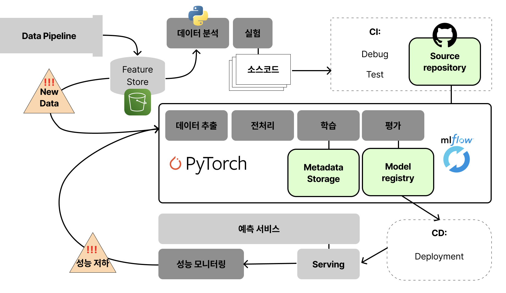

# 타이어 결함 이미지 분류하기
## 1. 개요
타이어 이미지를 받아 결함 여부를 판단해주는 모델을 관리합니다.
mlops level 2 아키텍처를 차용하여 모델을 프로덕현 환경에 안정적으로 배포하고, 자동화된 파이프라인으로 훈련, 배포, 모니터링 워크 플로우를 지원하는 체계를 구현하였습니다.

## 2. 아키텍처 개요


다음과 같은 컴포넌트로 구성하였습니다.
- **데이터 저장소**: 데이터가 버전 관리되며 실험에 사용할 수 있도록 구성됩니다. s3 를 사용하였습니다.
- **모델 훈련**: GitHub Actions를 사용하여 새로운 데이터를 통해 모델을 자동으로 훈련합니다.
- **모델 등록 및 추적**: MLflow를 사용하여 실험과 모델 성능을 기록하고 관리합니다.
- **모델 배포**: 모델을 Docker 컨테이너를 통해 프로덕션 환경에 배포합니다.
- **모델 모니터링**: 프로덕션 환경에서의 모델 성능을 모니터링하고 슬랙 알림을 통해 성능 저하에 대응합니다.

## 3. 기술 스택

| 역할 | 기술 스택 | 비고 |
|----|-----|-----|
|CI/CD| GitHub Actions| 자동화된 모델 훈련 및 배포를 위한 워크플로우 설정|
|실험 관리| MLflow| 모델 훈련 과정과 성능 지표 추적|
|데이터 저장| Amazon S3| 모델 아티팩트 저장소로 사용|
|데이터 저장| PostgreSQL, PGPool | 모델 파라미터, 메트릭 등 메타데이터 저장소로 사용|
|컨테이너| Docker |컨테이너화된 환경에서 모델을 배포|
|모델 훈련 및 서빙| PyTorch |모델 훈련과 추론을 위한 딥러닝 프레임워크|
|모델 모니터링| Prometheus, Grafana | 프로덕션에서의 모델 성능 모니터링|

## 4. 모델링 과정
결함 타이어 사진과 정상 타이어 사진 데이터를 대상으로 이진 분류 모델을 학습하고 평가합니다.

### 명령어 예시
```
python main.py Train --dataset_version split_1 --model_type cnn --optimizer_type adam --epochs 10 --learning_rate 0.01 --batch_size 32
```

### 1. Dataset 구성

데이터 레이크에서 이미지를 받아 디렉토리 구조에서 라벨 정보를 파싱합니다. 버킷 이름과 사용 목적(훈련용 또는 테스트용), 데이터 버전 정보를 받아 이미지와 라벨 정보를 반환합니다.
```
def _load_images(self, json_data):
    imgs = []
    try:
        for item in json_data['annotation']['data']:
            file_path = item['FilePath']
            label = item['label_value']
            imgs.append((file_path, label))
    except Exception as e:
        print(f"Json 파일로부터 이미지 경로와 라벨을 로드하는 중 오류 발생 : {e}")
    return imgs
    
def __getitem__(self, idx):
    key, class_idx = self.imgs[idx]
    image = self._load_image(key)
    if self.transform:
        image = self.transform(image)
    return image, class_idx
```

훈련 또는 테스트 과정에 따라 이미지를 다르게 전처리합니다.


```
def _get_transform(self, usage):
    transform_list = {
        'train': transforms.Compose([
            transforms.Resize((256, 256)),
            transforms.RandomHorizontalFlip(),
            transforms.RandomRotation(30),
            transforms.ColorJitter(),
            transforms.ToTensor(),
            transforms.Normalize([0.485, 0.456, 0.406], [0.229, 0.224, 0.225])
        ]),
        'test': transforms.Compose([
            transforms.Resize((256, 256)),
            transforms.ToTensor(),
            transforms.Normalize([0.485, 0.456, 0.406], [0.229, 0.224, 0.225])
        ]),
    }
```

데이터셋은 랜덤하게 스플릿하여 실험에 사용합니다.

```
sample_size = int(len(self.imgs) * 0.5)
self.imgs = random.sample(self.imgs, sample_size)
```

### 2. Model 구성
#### 1) models
이진분류에 사용된 모델은 다음과 같습니다.
* Efficientnet_b0, Efficientnet_b1, Efficientnet_b2, 
* Resnet 18, Resnet 50
* TinyVgg
* CNN

#### 2) 모델 학습 및 평가
모델 학습 시 실험 환경을 메타데이터 저장소에 기록합니다. 모델 타입, 모델 버전, 에포크, 옵티마이저 타입, 데이터셋 버전, 학습률, 배치사이즈를 기록합니다.
```
with mlflow.start_run(nested=True) as run:
    mlflow.log_param("model_name", model_name)
    mlflow.log_param("dataset_version", self.dataset_version)
    mlflow.log_param("epochs", self.epochs)
    mlflow.log_param("learning_rate", self.learning_rate)
    mlflow.log_param("batch_size", self.batch_size)
    mlflow.log_param("optimizer_type", self.optimizer_type)
    mlflow.log_param("early_stopping_min_loss", self.min_loss)
    mlflow.log_param("early_stopping_min_accuracy", self.min_accuracy)
```

에포크마다 모델을 학습하고, 성능을 테스트하며 그 결과를 기록합니다.


```
for epoch in range(self.epochs):
    print(f"Epoch {epoch + 1}/{self.epochs}\n--------------------------")
    self.train_model()
    loss, acc, precision, recall, f1 = self.test_model()
    print(f"loss : {loss}, acc : {acc}")
    mlflow.log_metric('Loss', loss, step=epoch)
    mlflow.log_metric('Accuracy', acc, step=epoch)
    mlflow.log_metric('Precision', precision, step=epoch)
    mlflow.log_metric('Recall', recall, step=epoch)
    mlflow.log_metric('F1_Score', f1, step=epoch)

    mlflow.log_param("Learning_rate_step", self.scheduler.get_last_lr()[0])

```

조기 종료 조건이 충족되면 모델을 등록하고 학습을 종료합니다.

```
def __call__(self, model, current_loss, current_acc):
    if current_loss <= self.min_loss and current_acc >= self.min_acc:
        print('조기 종료 조건을 만족하여 모델을 로그하고 학습을 종료합니다.')
        self.early_stop = True
        self.model_log_triggered = True
        return

    if self.best_loss is None or self.best_acc is None:
        self.best_loss = current_loss
        self.best_acc = current_acc
        #모델 로그하는 코드
    elif current_loss > self.best_loss - self.delta and current_acc < self.best_acc + self.delta:
        self.counter += 1
        if self.counter >= self.patience:
            self.early_stop = True
    else:
        self.best_loss = current_loss
        self.best_acc = current_acc
        self.counter = 0
```

최소 임계값을 넘지 못한 실험의 모델은 등록하지 않습니다.

```
if early_stopping.model_log_triggered :
    artifact_path = f'{model_name}'
    mlflow.pytorch.log_model(
        self.model,
        artifact_path=artifact_path,
        )
    model_uri = f"runs:/{run.info.run_id}/{artifact_path}"
    mlflow.register_model(model_uri=model_uri, name='Experiments', tags={"model_name":model_name})
    print('최소값을 넘겨 모델 등록에 성공하였습니다.')
else:
    print("최소값을 넘지 못해 모델 등록에 실패하였습니다.")
```
#### 3) 하이퍼파라미터 튜닝
매개변수로 하이퍼파라미터를 받고 그에 따라 학습을 진행합니다. 학습 전 파라미터 값이 유효한지 검증합니다.```
optimizer_type_enum = getattr(OptimizerType, self.optimizer_type.upper(), None)
if optimizer_type_enum is None:
    raise ValueError(f"지원되지 않는 옵티마이저 타입입니다.: {self.optimizer_type}")

self.optimizer = get_optimizer(optimizer_type_enum, self.model, self.learning_rate)
```

## 5. 기능 구현

### 1. 새로운 데이터가 데이터 레이크에 저장되면 자동화 워크플로우로 모델 학습 및 stage 모델 선정
airflow dag에서 새로운 데이터 수집을 마치면 github actions를 트리거해 test를 수행하고, 모델 훈련이 시작됩니다. 
모델 훈련이 되는 동안 관련 값들이 RDB, S3 model registry에 기록되고 mlflow 서버 UI를 통해 확인할 수 있습니다.
모델 훈련이 완료되면 새로운 실험을 포함해 stage 모델을 선정합니다. 

```
on:
  repository_dispatch:
    types: [trigger_action]  # Airflow에서 보내는 `trigger_action` 이벤트를 감지
  workflow_dispatch:

jobs:
  run_triggered_job:
    runs-on: [self-hosted, linux, X64]
    steps:
    - name: Print message from Airflow
      run: echo "${{ github.event.client_payload.message }}"

    - name: Print folder path
      run: echo "${{ github.event.client_payload.folder_path }}"

         ...

    - name: 학습 시나리오 수행
      run: docker run --gpus all --network flatfix_mlflow-network --rm flatfix-train-model python train_senario.py
              
```

### 2. 새로운 모델 소스가 추가되면 자동화 워크플로우로 모델 학습 및 stage 모델 선정

새로운 모델 소스가 commit 또는 pull request 되어 머지가 완료되면 커밋 메세지로부터 새로운 모델의 이름을 받아 해당 모델에 대한 미리 정의된 기본 학습을 수행합니다.
모델 훈련이 완료되면 새로운 실험을 포함해 stage 모델을 선정합니다.

```
jobs: 
  get-model-name:
    if: github.event_name != 'workflow_dispatch'
    runs-on: ubuntu-latest
    outputs:
      model_name: ${{ steps.extract.outputs.model_name }}
    steps:
      - name: Checkout code
        uses: actions/checkout@v2

      - name: 디버그 로그 보기
        run: |
          echo "GITHUB_ACTIONS_DEBUG=true" >> $GITHUB_ENV

      - name: 커밋 메시지로부터 모델명 받기 ('model:' 모델명 형식의 메시지를 파싱)
        id: extract
        run: |
          COMMIT_MESSAGE=$(git log -1 --pretty=%B)
          echo "Commit message: $COMMIT_MESSAGE"

          if [[ "$COMMIT_MESSAGE" =~ model:\ (.+) ]]; then
            MODEL_NAME="${BASH_REMATCH[1]}"
            echo "찾은 모델명 : $MODEL_NAME"
            echo "::set-output name=model_name::$MODEL_NAME"
          else
            echo "커밋 메시지에서 모델명을 찾을 수 없습니다."
            exit 1
          fi

          ...

    - name: 새로운 모델 학습
        run: |
          docker run --gpus all  --network flatfix_mlflow-network --rm flatfix-train-model \
            python /app/main.py Train \
            --model_type ${{ github.event_name != 'workflow_dispatch' && needs.get-model-name.outputs.model_name || 'efficientnet' }} \
            --dataset_version version_1 \
            --epochs 5 \
            --optimizer_type adam
```

### 3. 다른 지표를 이용해 stage 모델 선정
여러가지 지표를 수집하고 있으므로 다양한 지표를 기준으로 stage 모델을 선정할 수 있습니다. 모델 선정이 완료되면 이 모델을 바탕으로 테스트 서버에 배포합니다.
```
on:
  workflow_dispatch:
    inputs:
      eval_metric:  
        description: "어떤 지표를 기준으로 스테이지 하시겠습니까?"
        required: true
        default: "Loss"
        type: choice
        options:
          - "Loss"
          - "Accuracy"
          - "F1"
          - "Recall"
          - "Precision"

jobs:
  run_triggered_job:
    runs-on: [self-hosted, linux, X64]
    outputs:
      deploy_stage: ${{ github.event.inputs.deploy_stage }}  
      
      
      ...

    - name: 학습 시나리오 수행
      run: docker run --gpus all --network flatfix_mlflow-network --rm flatfix-train-model \
        python main.py Stage ${{ github.event.inputs.eval_metric }}              

```

### 4. 테스트가 완료된 stage 모델의 production 모델로의 승격과 운영 모델의 배포
stage 모델의 테스트가 완료되었고, production 모델로의 승격이 이루어져야 하는 경우에 기존의 운영 모델은 archived 스테이지로 내려주고 stage 모델을 운영 모델로 변경하는 과정을 진행합니다. 이후 운영 모델의 변경을 감지한 백엔드 서버가 모델을 다시 로드하여 서비스를 운영합니다.
이때도 다양한 지표 중 하나를 선택하여 스테이지 모델 중 운영 모델로 올라갈 것을 선택합니다. 

```

on:
  workflow_dispatch:
    inputs:
      eval_metric:  
        description: "어떤 지표를 기준으로 운영 모델을 등록하시겠습니까?"
        required: true
        default: "Loss"
        type: choice
        options:
          - "Loss"
          - "Accuracy"
          - "F1"
          - "Recall"
          - "Precision"

          ...

    - name: 운영 모델 결정
      run: docker run --gpus all --network flatfix_mlflow-network --rm flatfix-train-model \
        python main.py Produce ${{ github.event.inputs.eval_metric }}
    
    - name: 운영 모델 uri 프린트
      run: docker run --gpus all --network flatfix_mlflow-network --rm flatfix-train-model \
        python main.py ProductionInfo
    
```
